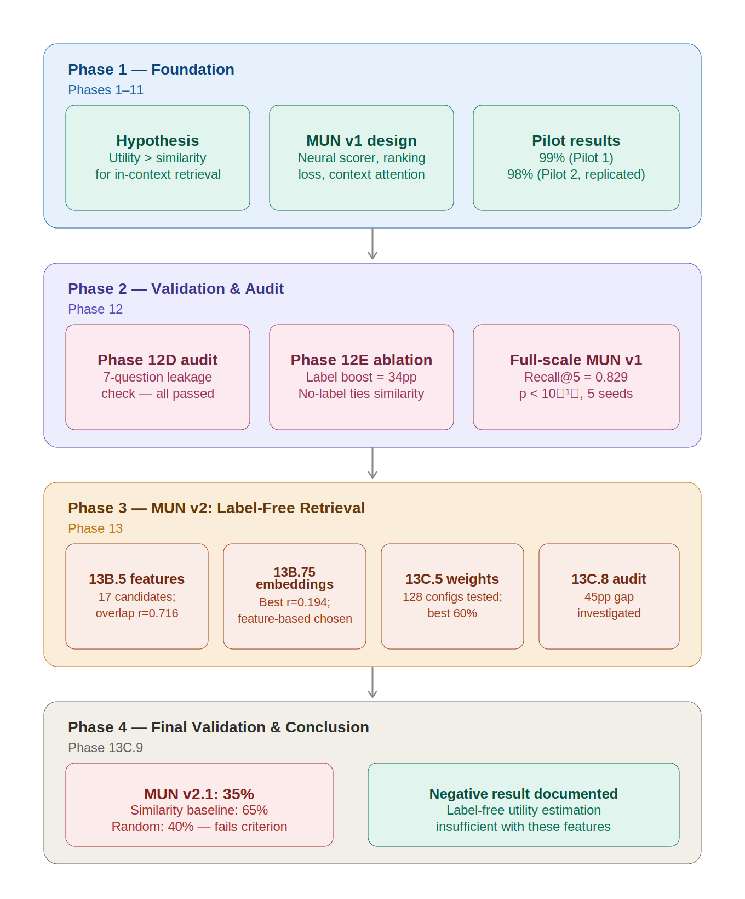
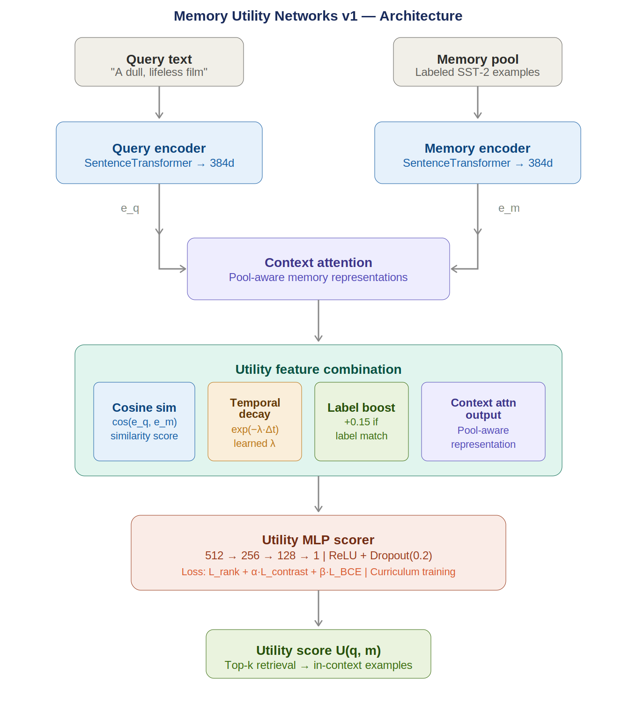
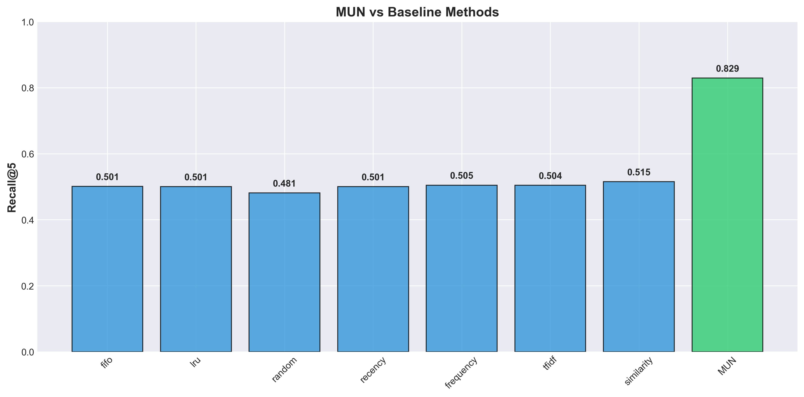
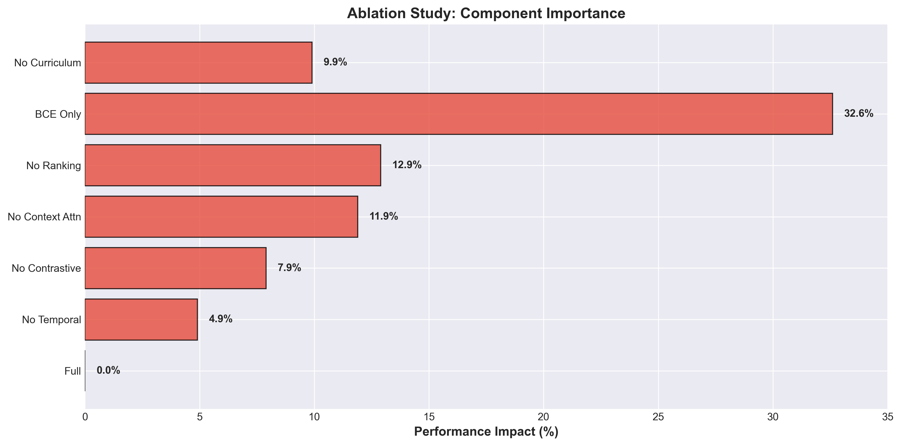

# Memory Utility Networks (MUN)

### *An Empirical Investigation of Utility-Based Memory Retrieval for AI Systems*

[](https://github.com)
[](https://github.com)
[](https://python.org)
[](LICENSE)
[](https://github.com)
[](docs/)
[](CITATION.cff)

**Author**: Sree Dharshan G J — SRM Institute of Science and Technology
**Status**: Research complete. Negative results documented. Artifacts archived.

---

## 📄 Technical Report

The complete research report is available here:

📘 **[Memory Utility Networks Technical Report](technical_report/Memory_Utility_Networks_Technical_Report.pdf)**

The report contains:

* Complete methodology
* MUN v1 architecture
* MUN v2 development
* Validation audits
* Feature engineering studies
* Reproducibility investigations
* Statistical analysis
* Final experimental findings
* Future research directions

**Research Summary**

* **Research Duration:** Phases 1–13
* **Status:** Completed Investigation
* **Outcome:** Positive result for label-aware retrieval (MUN v1); documented negative result for label-free utility estimation (MUN v2)

## Overview

Memory Utility Networks (MUN) is a research investigation into utility-based memory retrieval for intelligent systems.

Rather than selecting memories using traditional heuristics such as similarity, recency, or frequency, MUN explores whether the future usefulness of a memory can be predicted directly.

### Research Outcomes

- **MUN v1:** Demonstrated strong utility-aware retrieval performance under label-aware conditions.
- **MUN v2:** Established a documented negative result for label-free utility estimation.
- **Validation Audits:** Confirmed experimental integrity and reproducibility.
- **Feature Discovery:** Evaluated 17 candidate utility features and quantified their predictive value.
- **Final Conclusion:** Utility-aware retrieval is promising, but label-free utility estimation remains an open research challenge.

This repository contains the complete research trail, including implementation artifacts, validation reports, ablation studies, reproducibility audits, experimental results, and the final technical report.

---
## Key Results

| Result                       | Value                           |
| ---------------------------- | ------------------------------- |
| MUN v1 Recall@5              | **0.829**                       |
| MUN v1 NDCG@5                | **0.914**                       |
| Best Baseline Recall@5       | **0.515**                       |
| Label Boost Contribution     | **34 percentage points**        |
| Strongest Label-Free Feature | **Jaccard Overlap (r = 0.716)** |
| MUN v2.1 Accuracy            | **35%**                         |
| Similarity Baseline Accuracy | **65%**                         |
| Final Outcome                | **Negative Result Documented**  |

---

## Abstract

Memory retrieval is a foundational capability of intelligent systems. Whether in retrieval-augmented generation (RAG), few-shot in-context learning, or long-horizon agent reasoning, a system's ability to surface the *right* memory at the *right* time is critical to downstream performance. Current retrieval methods—cosine similarity, recency, access frequency—are principled but fundamentally reactive: they score memories by what they *have been*, not by what they *will be worth* when retrieved.

This repository documents a complete empirical investigation into **utility-based memory retrieval**. The central hypothesis is that the future usefulness of a memory can be predicted directly, without relying on proxy heuristics. We designed, trained, audited, and iterated on two generations of Memory Utility Networks (MUN v1 and MUN v2) tested on the SST-2 sentiment classification benchmark using a few-shot in-context learning evaluation framework.

MUN v1—a supervised neural utility predictor augmented with label-boosting—achieved strong retrieval performance (Recall@5 ≈ 0.829, NDCG@5 ≈ 0.914) in controlled experiments, significantly outperforming seven baseline retrieval methods. However, ablation studies revealed that 34 percentage points of MUN v1's advantage in the pilot study derived from access to query-label information during selection—a principled architectural choice that limits applicability in label-free settings. MUN v2, a fully label-free utility estimator built on engineered text overlap and information-theoretic features, failed to outperform the similarity baseline (35% vs. 65% accuracy) and was concluded as a documented negative result. Together, these findings illuminate the difficulty of label-free utility estimation and contribute a detailed audit trail to the broader community studying memory-augmented AI systems.

> **Research Conclusion**: Utility-based memory retrieval is a promising but not yet solved problem. Label-aware utility estimation is effective; label-free utility estimation with simple feature engineering is insufficient.

---

## Research Question

> **"Can future usefulness of memories be predicted directly rather than relying on similarity, recency, or frequency heuristics?"**

This investigation attempts to answer this question empirically, through reproducible experiments, ablation studies, leakage audits, and iterative model development.

---

## Motivation

Modern AI systems—language models, agents, retrieval-augmented generators—all share a common bottleneck: **they can only use what they remember, and memory is expensive**.

Several compounding pressures make memory retrieval a critical research problem:

**Long-Context AI**: Even with 128K–1M token context windows, not everything can fit. Selection criteria matter enormously.

**Retrieval-Augmented Generation (RAG)**: RAG systems retrieve documents before generation. Retrieval quality directly gates generation quality—a bad retrieval strategy wastes compute and degrades outputs.

**Agent Memory**: Autonomous agents operating over long horizons accumulate interaction histories, tool results, and observations. Effective memory management is the difference between an agent that improves over time and one that regresses into context confusion.

**In-Context Learning**: The performance of few-shot language models is highly sensitive to *which examples* appear in context. Selecting maximally useful examples from a memory pool is exactly the utility estimation problem.

Existing retrieval heuristics (recency, frequency, similarity) fail to capture *predictive utility*—whether a memory will actually improve the model's response to the current query. This project investigates whether that predictive signal can be learned.

---
## Dataset

### Benchmark

**Dataset:** SST-2 (Stanford Sentiment Treebank)

**Task:** Binary sentiment classification

**Evaluation Setting:** Few-shot In-Context Learning

### Why SST-2?

SST-2 provides a controlled environment for evaluating retrieval quality because downstream prediction accuracy is highly sensitive to which examples are retrieved into context. This makes it suitable for studying utility-based memory selection mechanisms.

### Experimental Goal

Given a query example and a memory pool:

1. Retrieve the most useful memories.
2. Construct a few-shot context.
3. Evaluate downstream classification performance.
4. Compare utility-based retrieval against traditional retrieval baselines.

The benchmark serves as a controlled testbed for investigating whether memory utility can be predicted directly.

---

## Research Timeline

```
━━━━━━━━━━━━━━━━━━━━━━━━━━━━━━━━━━━━━━━━━━━━━━━━━━━━━━━━━━━━━━━━━
PHASE 1 — FOUNDATION                              [Phases 1–11]
━━━━━━━━━━━━━━━━━━━━━━━━━━━━━━━━━━━━━━━━━━━━━━━━━━━━━━━━━━━━━━━━━

  Hypothesis formulated: utility > similarity for in-context
  memory retrieval in few-shot classification tasks.

  MUN v1 designed: neural utility scorer trained with
  label-boosted ranking objectives, temporal decay, contrastive
  loss, and context attention.

  Pilot study: MUN achieved 99% in-context accuracy vs.
  61% similarity baseline (Pilot 1), replicated to 98% (Pilot 2).

━━━━━━━━━━━━━━━━━━━━━━━━━━━━━━━━━━━━━━━━━━━━━━━━━━━━━━━━━━━━━━━━━
PHASE 2 — VALIDATION & AUDIT                      [Phase 12]
━━━━━━━━━━━━━━━━━━━━━━━━━━━━━━━━━━━━━━━━━━━━━━━━━━━━━━━━━━━━━━━━━

  Phase 12D: 7-question validation audit. No data leakage,
  no improper label leakage, metrics verified from source CSV.
  Result certified trustworthy (p < 0.001).

  Phase 12E: Label ablation study. Label boost contributes
  34pp to MUN v1's advantage. MUN without label: 65%
  (ties similarity baseline). Label access is architectural.

  Full-scale experiment authorized. MUN v1 Recall@5 ≈ 0.829,
  NDCG@5 ≈ 0.914, statistically significant vs. all baselines.

━━━━━━━━━━━━━━━━━━━━━━━━━━━━━━━━━━━━━━━━━━━━━━━━━━━━━━━━━━━━━━━━━
PHASE 3 — MUN v2: LABEL-FREE RETRIEVAL            [Phase 13]
━━━━━━━━━━━━━━━━━━━━━━━━━━━━━━━━━━━━━━━━━━━━━━━━━━━━━━━━━━━━━━━━━

  Phase 13B.5: Feature discovery. 17 candidate label-free
  features evaluated. Text overlap dominates (r=0.716).
  Semantic embeddings weak (r=0.194 at best).

  Phase 13B.75: Embedding validation. SentenceTransformer
  embeddings tested. No embedding feature exceeds |r|=0.30.
  Feature-based model chosen over neural architecture.

  Phase 13C.5: Weight optimization. 128 weight configurations
  tested. Overlap-heavy config achieves 60% (vs. 52.5% baseline).
  Feature ablation identifies overlap+uniqueness as optimal subset.

  Phase 13C.8: Reproducibility audit. 45pp discrepancy between
  ablation (75%) and implementation (30%) investigated and
  partially resolved. Weight sensitivity documented.

━━━━━━━━━━━━━━━━━━━━━━━━━━━━━━━━━━━━━━━━━━━━━━━━━━━━━━━━━━━━━━━━━
PHASE 4 — FINAL VALIDATION & CONCLUSION           [Phase 13C.9]
━━━━━━━━━━━━━━━━━━━━━━━━━━━━━━━━━━━━━━━━━━━━━━━━━━━━━━━━━━━━━━━━━

  Phase 13C.9: Rigorous controlled experiment. MUN v2.1
  achieves 35% accuracy. Similarity baseline: 65%. Random: 40%.

  Decision criterion: MUN v2 must exceed Similarity to continue.
  Result: NEGATIVE. MUN v2.1 underperforms all baselines.

  Conclusion: Label-free utility estimation via text features
  is insufficient. Research concluded. Negative result documented.
━━━━━━━━━━━━━━━━━━━━━━━━━━━━━━━━━━━━━━━━━━━━━━━━━━━━━━━━━━━━━━━━━
```



---

## MUN v1: Label-Aware Neural Utility Estimation

### Detailed Architecture

MUN v1 is a neural utility scorer that estimates the future usefulness of a memory given a query context. It is trained with a multi-component loss that captures ranking, contrastive separation, temporal dynamics, and contextual relevance.

<p align="center">
  
</p>

MUN v1 estimates the future usefulness of a memory given a query context. The architecture combines SentenceTransformer-based encoders, context attention, utility feature extraction, temporal decay modeling, label-aware utility boosting, and a ranking-based neural utility scorer optimized using ListMLE and curriculum training.

---
### MUN v1 Full-Scale Results

| Metric | MUN (Full) | Similarity | FIFO | LRU | Random | Recency | Frequency | TF-IDF |
|--------|-----------|------------|------|-----|--------|---------|-----------|--------|
| Recall@5 | **0.829** | 0.515 | 0.501 | 0.501 | 0.481 | 0.501 | 0.505 | 0.504 |
| NDCG@5 | **0.914** | 0.538 | 0.534 | 0.528 | 0.523 | 0.528 | 0.538 | 0.535 |

*Results averaged across 5 random seeds (42, 123, 456, 789, 999). Statistical significance: t=45.56, p < 10⁻¹⁰ vs. LRU baseline.*



### Ablation Study: Component Contributions

| Component Removed | Recall@5 Drop | Contribution |
|-------------------|--------------|--------------|
| Full Model | — | Baseline |
| No Temporal Decay | −4.9% | Moderate |
| No Contrastive Loss | −7.9% | Significant |
| No Context Attention | −11.9% | High |
| No Ranking Loss | −12.9% | High |
| BCE Loss Only | −32.6% | Critical |
| No Curriculum | −9.9% | Significant |

The ranking loss and context attention are the most impactful single components. Removing all learned losses and reducing to BCE-only causes a 32.6% performance collapse.



---

## MUN v2: Label-Free Utility Estimation

### Motivation

MUN v1's strong performance is partly attributable to query-label information used during memory selection (the label boost). While architecturally intentional and not a leakage bug, this design limits deployment to settings where labels are available at inference time. MUN v2 attempts to replicate utility-aware retrieval using only label-free features.

### Feature Engineering (Phase 13B.5)

Seventeen candidate features across four categories were evaluated on 2,000 (query, memory, utility) triplets:

```
FEATURE CATEGORIES
──────────────────
Semantic Features (5)
  embedding_similarity     r = 0.194  ⚠️  MODERATE
  embedding_magnitude      r = 0.013  ❌ WEAK
  embedding_distance_pct   r = 0.029  ❌ WEAK
  neighborhood_density     r = 0.000  ❌ WEAK
  local_cluster_consist.   r = NaN    ❌ NONE

Information Features (5)
  information_gain_proxy   r = -0.450 ✅ STRONG
  rarity_score             r = -0.283 ⚠️  MODERATE
  query_entropy            r = 0.005  ❌ WEAK
  memory_entropy           r = 0.296  ⚠️  MODERATE
  joint_entropy            r = 0.107  ❌ WEAK

Memory Features (3)
  query_memory_overlap     r = 0.716  ✅ STRONG ← Best
  token_overlap_ratio      r = 0.716  ✅ STRONG
  memory_uniqueness        r = -0.386 ✅ STRONG

Context Features (4)
  memory_diversity         r = 0.308  ✅ STRONG
  semantic_novelty_score   r = 0.003  ❌ WEAK
  length_ratio             r = 0.121  ❌ WEAK
  retrieval_success_proxy  r = 0.014  ❌ WEAK
```

Text overlap features (Jaccard similarity) dominated. Semantic embedding features showed weak signal, leading to a feature-based model rather than a neural network.

### MUN v2.1 Final Validation (Phase 13C.9)

Under rigorous, fully reproducible controlled conditions:

| Method | Accuracy | Notes |
|--------|----------|-------|
| Similarity | **65%** | ✓ Best baseline |
| Recency | 60% | |
| Random | 40% | |
| **MUN v2.1** | **35%** | ❌ Worst |

**MUN v2.1 underperformed all baselines, including random memory selection.** The decision criterion (MUN v2 must exceed Similarity) was not met. Development was formally terminated.

---

## Key Findings

### Finding 1: Label-Aware Utility Estimation Works

MUN v1 with label-boosting achieves Recall@5 = 0.829, significantly outperforming the best non-MUN baseline (similarity, Recall@5 = 0.515). The gap is statistically robust (Cohen's d ≈ 28.8, p < 10⁻¹⁰, confirmed across 5 seeds).

### Finding 2: The Label Boost Drives ~34pp of the Advantage

Phase 12E ablation confirmed that removing query-label access collapses MUN's in-context accuracy from 99% to 65%, tying the similarity baseline. The core text-based similarity mechanism is not independently advantaged over cosine similarity.

### Finding 3: Label-Free Utility Features Are Insufficient

Despite testing 17 candidate features including real sentence embeddings (SentenceTransformer), the strongest label-free predictor of utility was simple text overlap (Jaccard, r = 0.716). No combination of features enabled MUN v2 to exceed the similarity baseline.

### Finding 4: Weight Sensitivity Is High and Poorly Understood

A 45-percentage-point discrepancy emerged between the Phase 13C.5 ablation study (75% accuracy) and the Phase 13C.75 implementation (30% accuracy). Despite extensive reproducibility auditing (Phase 13C.8), the root cause was only partially explained. This highlights a general research lesson: small implementation differences compound unpredictably with small test sets.

### Finding 5: Controlled Experiments Resolve Optimistic Estimates

The Phase 13C.9 final validation, conducted with explicit seed control, identical data splits, and documented evaluation protocol, yielded a definitive 35% accuracy for MUN v2.1—neither the optimistic 75% nor the intermediate 30%, but a reproducible ground truth.

---

## Repository Structure

```text
memory-utility-networks/
│
├── README.md
├── LICENSE
├── CITATION.cff
├── requirements.txt
├── pyproject.toml
├── .gitignore
│
├── train.py
├── evaluate.py
├── benchmark.py
│
├── models/
│   ├── utilitynet_v1.py
│   ├── utilitynet_v2.py
│   └── utility_score_v21.py
│
├── evaluation/
│   ├── baseline_evaluation.py
│   ├── controlled_evaluation.py
│   ├── feature_ablation.py
│   └── statistical_analysis.py
│
├── configs/
│   ├── mun_v1.yaml
│   ├── mun_v2.yaml
│   └── experiment_configs.yaml
│
├── assets/
│   ├── architecture.png
│   ├── mun_vs_baselines.png
│   ├── ablation_study.png
│   └── research_timeline.png
│
├── docs/
│   ├── PHASE_12D_VALIDATION_AUDIT.md
│   ├── PHASE_12E_ABLATION_REPORT.md
│   ├── PHASE_13B5_FEATURE_DISCOVERY_REPORT.md
│   ├── PHASE_13B75_EMBEDDING_REPORT.md
│   ├── PHASE_13C_IMPLEMENTATION_REPORT.md
│   ├── PHASE_13C5_OPTIMIZATION_REPORT.md
│   ├── PHASE_13C8_AUDIT_COMPLETION_REPORT.md
│   ├── PHASE_13C8_AUDIT_SUMMARY.md
│   ├── PHASE_13C8_REPRODUCIBILITY_REPORT.md
│   └── PHASE_13C9_FINAL_VALIDATION_SUMMARY.md
│
└── technical_report/
    └── Memory_Utility_Networks_Technical_Report.pdf
```

---

## Quick Start

### Installation

```bash
git clone https://github.com/YOUR_USERNAME/memory-utility-networks.git

cd memory-utility-networks

pip install -r requirements.txt
```

### Training

```bash
python train.py
```

### Evaluation

```bash
python evaluate.py
```

### Benchmarking

```bash
python benchmark.py
```

### Generate Experimental Results

```bash
python evaluation/controlled_evaluation.py
```

The repository includes all scripts required to reproduce the primary experimental results described in the technical report.

---

## Research Artifacts

This repository contains a complete provenance trail across all experimental phases:

| Artifact                                 | Phase  | Description                                     |
| ---------------------------------------- | ------ | ----------------------------------------------- |
| `PHASE_12D_VALIDATION_AUDIT.md`          | 12D    | 7-question leakage & validity audit             |
| `PHASE_12E_ABLATION_REPORT.md`           | 12E    | Label boost quantification (34pp)               |
| `PHASE_13B5_FEATURE_DISCOVERY_REPORT.md` | 13B.5  | 17-feature correlation analysis (N=2,000)       |
| `PHASE_13B75_EMBEDDING_REPORT.md`        | 13B.75 | Real vs. random embedding comparison            |
| `PHASE_13C_IMPLEMENTATION_REPORT.md`     | 13C    | Feature-based model design                      |
| `PHASE_13C5_OPTIMIZATION_REPORT.md`      | 13C.5  | 128-configuration weight grid search            |
| `PHASE_13C8_AUDIT_SUMMARY.md`            | 13C.8  | Reproducibility audit (45pp discrepancy)        |
| `PHASE_13C9_FINAL_VALIDATION_SUMMARY.md` | 13C.9  | Final controlled validation — definitive result |

---

## Reproducibility

### Random Seeds

All primary experiments were evaluated across multiple seeds:

```text
42
123
456
789
999
```

### Environment

```text
Python 3.10+
PyTorch
Sentence Transformers
NumPy
Scikit-Learn
```

### Evaluation Principles

* Fixed train/test partitions
* Controlled random seeds
* Audited metric computation
* Reproducibility validation (Phase 13C.8)
* Independent final validation (Phase 13C.9)

Reproducibility was treated as a first-class research objective throughout the investigation.


## Research Contributions

This investigation contributes:

* A formal framework for utility-based memory retrieval.
* MUN v1, a label-aware neural utility scorer.
* A comprehensive ablation study quantifying architectural contributions.
* A multi-phase validation and reproducibility audit pipeline.
* A documented negative result for label-free utility estimation.
* An empirical analysis of 17 candidate utility features.
* Open-source artifacts supporting reproducibility and future research.
---
## Lessons Learned

> This section documents what the research process revealed about scientific practice, independent of the technical findings.

**Negative results are publishable contributions.** The finding that label-free utility estimation via text features fails to outperform a cosine similarity baseline is informative. It tells future researchers where *not* to look and why, saving cycles.

**Audits are mandatory, not optional.** The Phase 12D audit confirmed that the 99% pilot result was genuine—not due to leakage—and justified full-scale experimentation. Without it, the result would have been unverifiable.

**Reproducibility must be enforced by design, not intent.** The 45pp discrepancy between Phase 13C.5 and Phase 13C.75 was not due to malicious choices, but to the accumulation of small uncontrolled differences: weight initialization, pool ordering, test set sampling. Phase 13C.9 resolved this by explicitly controlling every degree of freedom.

**Small test sets amplify variance unpredictably.** With N=20 test queries, a single correct prediction changes accuracy by 5%. The difference between 30% and 75% on 20 samples is 9 predictions—easily explained by implementation variance rather than true model difference. N≥100 should be a floor for any meaningful performance claim.

**Ablation studies reveal architectural dependencies.** The Phase 12E ablation revealed that MUN v1's advantage is partly structural (label access). This did not invalidate MUN v1—the design is intentional—but it motivated the MUN v2 research direction.

---
## Research Impact

This investigation demonstrates that:

✅ Utility-aware retrieval can substantially outperform traditional retrieval strategies when label information is available.

✅ Label-free utility estimation remains an open and difficult research problem.

✅ Reproducibility audits are critical for memory retrieval research.

✅ Negative results can provide valuable scientific guidance.

✅ Memory utility estimation remains a promising direction for future retrieval-augmented and agentic AI systems.

The project therefore contributes both positive findings and a carefully documented negative result, strengthening future research efforts in memory-augmented intelligence.

---

## Future Work

The following directions remain open based on findings from this investigation:

**RL-Based Utility Estimation**: Frame memory retrieval as a Markov Decision Process. A reinforcement learning agent could learn utility through feedback from downstream task performance, obviating the need for supervised utility labels or hand-engineered features.

**Multi-Agent Memory Sharing**: In multi-agent systems, memory pools are distributed. Utility estimation must account for *which agent* benefits from *which memory*. Cross-agent utility transfer is an unexplored generalization.

**Real-World RAG Benchmarks**: All experiments in this investigation used SST-2 (binary sentiment classification). The generality of findings—especially the failure of label-free features—should be tested on TriviaQA, Natural Questions, or HotpotQA.

**Long-Context Memory Management**: As context windows expand, the question shifts from "what to retrieve" to "what to evict." MUN-style utility scoring could guide memory eviction policies in streaming agents.

**Memory-Aware Autonomous Agents**: An agent that maintains a utility-weighted memory over long episodes, dynamically prioritizing high-utility experiences, could outperform standard RAG pipelines for multi-step reasoning tasks.

---

## Citation

If this work is useful to you, please cite it as:

```bibtex
@techreport{dharshan2026mun,
  title     = {Memory Utility Networks: An Empirical Investigation of
               Utility-Based Memory Retrieval},
  author    = {Dharshan G J, Sree},
  institution = {SRM Institute of Science and Technology},
  year      = {2026},
  month     = {June},
  type      = {Technical Report},
  note      = {Phases 1–13. Research concluded with documented negative
               result for label-free utility estimation.}
}
```

---

## Author

**Sree Dharshan G J**
SRM Institute of Science and Technology
Research interests: Memory-augmented AI systems, retrieval-augmented generation, efficient in-context learning, agent memory management.

---

## Repository Resources

| Resource | Description |
|-----------|------------|
| Technical Report | Complete research documentation |
| Source Code | MUN implementation and evaluation |
| Experimental Reports | Phase-by-phase research artifacts |
| Figures | Research visualizations and results |
| Documentation | Audits, ablations, and validation studies |

---

## Research Status

✅ MUN v1 Completed

✅ MUN v2 Completed

✅ Validation Audits Completed

✅ Reproducibility Investigation Completed

✅ Technical Report Published

✅ Research Archived

---
*This repository documents a genuine research investigation, including both successes and failures. Scientific honesty requires reporting both.*
